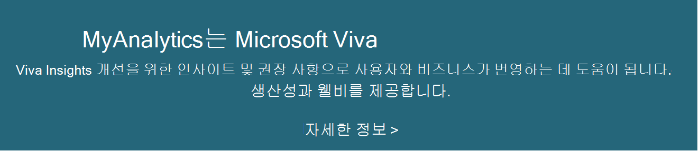

# MyAnalytics 서비스 설명

MyAnalytics는 직장에서 시간을 보내는 방법을 요약한 다음 더 스마트하게 작업하는 방법을 제안합니다. MyAnalytics는 Microsoft Outlook 또는 웹  브라우저를 통해 액세스할 수 있는 요소를 통해 이러한 정보를 제공합니다.

MyAnalytics의 일부 요소는 다양한 계획의 사용자에게 Office 365 제공됩니다. 계획 및 계획에 포함된 요소를 Office 365 Microsoft 365 [MyAnalytics 계획 및 환경을 참조하세요](/workplace-analytics/myanalytics/overview/plans-environments).  

MyAnalytics는 직원 개인 정보를 보호하는 방식으로 정보를 처리합니다. 자세한 내용은 데이터 개인 정보를 [참조하세요](#data-privacy).

## 사용 가능한 플랜

사용자가 MyAnalytics를 사용할 수 있도록 하는 구독에 대한 자세한 계획 정보는 전체 구독 비교 표 [를 참조하세요](https://go.microsoft.com/fwlink/?linkid=2139145).

## 요소

MyAnalytics는 다음 요소로 구성됩니다.

* [대시보드](/workplace-analytics/myanalytics/use/dashboard-2): 집중된 작업 시간, 모임 및 전자 메일 사례, 네트워킹 등의 작업 패턴을 반영하는 데 도움이 됩니다.
* [Outlook 추가](/workplace-analytics/myanalytics/use/add-in) 기능: 작업의 맨 위에 Outlook 더 많은 작업을 수행하는 데 도움이 되는 실행 가능한 정보를 제공합니다.
* [전자 메일 다이제스트](/workplace-analytics/myanalytics/use/email-digest-2): 주간 전자 메일의 작업 패턴에 대한 주요 강조 정보를 제공합니다.
* [인라인 제안](/workplace-analytics/myanalytics/use/mya-notifications): 전자 메일이나 모임 초대를 읽거나 Outlook 동안 이러한 간단한 데이터 기반 제안과 AI 기반 제안이 표시됩니다.

## 데이터 개인 정보

MyAnalytics는 다음 지침을 준수하여 직원 개인 정보를 보호하고 현지 규정 준수를 지원합니다.

* MyAnalytics는 직원 평가, 추적, 자동화된 의사 결정, 프로파일링 또는 모니터링을 사용하도록 설계되지 않았습니다.
* MyAnalytics는 직원이 다른 동료의 새로운 개인 식별 정보에 액세스할 수 있는 권한을 제공하지 않습니다.
* 직원의 Exchange Online 사서함에서 MyAnalytics 데이터가 처리되고 저장됩니다.
* MyAnalytics는 GDPR(일반 데이터 보호 규정) 준수를 지원합니다.
* MyAnalytics를 구성하여 사용자가 목절에 맞게 참여하도록 할 수 있습니다.
* MyAnalytics 및 Delve 상호 관계가 없는 별도의 응용 프로그램입니다.
* MyAnalytics는 사람들에게 데이터가 비공개이고 안전한지를 알립니다.

자세한 내용은 개인 정보 보호 가이드 [를 참조하세요](/viva/insights/personal/overview/privacy-guide-users).

[MyAnalytics를 통해 더 스마트하게 작업하는 데 도움이 되는 방법에 대해 자세히 알아보고.](https://products.office.com/business/myanalytics-personal-analytics)

## 필수 구성 요소

* [Microsoft Exchange Online](./exchange-online-service-description/exchange-online-service-description.md)