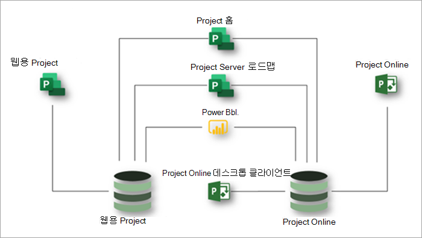

# Microsoft Project 서비스 설명Microsoft Project service description

## 개요Overview

Microsoft Project는 프로젝트 및 작업 관리에 대한 조직의 요구 사항을 충족하는 데 도움이 되는 다음과 같은 응용 프로그램을 제공합니다.Microsoft Project offers the following applications to help meet your organization's needs for project and work management:

- 웹용 ProjectProject for the web
- Project OnlineProject Online 
- Project Online 데스크톱 클라이언트Project Online desktop client

이 문서에서는 각 Project 구독에서 제공되는 응용 프로그램과 각 응용 프로그램에서 제공하는 기능을 이해하는 데 도움이 됩니다.This article will help you understand which applications are provided in each Project subscription and what capabilities each application offers.

### 웹용 ProjectProject for the web

웹용 Project는 클라우드 기반 작업 및 프로젝트 관리를 위한 Microsoft의 최신 제품입니다.Project for the web is Microsoft's most recent offering for cloud-based work and project management. 웹용 Project는 대부분의 요구와 역할을 충족할 수 있는 간단하고 강력한 작업 관리 기능을 제공합니다.Project for the web provides simple, powerful work management capabilities to meet most needs and roles. 프로젝트 관리자와 팀 구성원은 웹용 Project를 사용하여 모든 크기의 작업을 계획하고 관리할 수 있습니다.Project managers and team members can use Project for the web to plan and manage work of any size.

웹용 Project는 Microsoft Power Platform을 통해 구축됩니다.Project for the web is built on the Microsoft Power Platform. Power Platform은 PowerApps, Power Automate, Power BI 및 Microsoft Dataverse로 구성됩니다.The Power Platform consists of PowerApps, Power Automate, Power BI, and the Microsoft Dataverse. 웹 데이터용 Project는 Microsoft Dataverse에 저장됩니다.Project for the web data is stored in the Microsoft Dataverse. 

웹용 Project는 Project Plan 1, Project Plan 3 및 Project Plan 5의 세 가지 구독을 통해 사용할 수 있습니다.Project for the web is available through three subscriptions: Project Plan 1, Project Plan 3, and Project Plan 5. 웹용 [Project 기능에](#project-for-the-web-features) 나열된 기능은 웹용 Project 데이터 저장소의 데이터와만 상호 작용합니다.Features listed in [Project for the web features](#project-for-the-web-features) interact only with data in the Project for the web data store.

### Project OnlineProject Online
 
Project Online은 PPM(프로젝트 포트폴리오 관리) 및 일상 업무를 위한 유연한 온라인 솔루션입니다.Project Online is a flexible online solution for Project Portfolio Management (PPM) and everyday work. Project Online은 거의 모든 장치에서 거의 모든 장치에서 프로젝트 및 프로젝트 포트폴리오 투자를 계획, 우선 순위 지정 및 관리하기 위한 강력한 프로젝트 &mdash; 관리 기능을 제공합니다.Project Online provides powerful project management capabilities for planning, prioritizing, and managing projects and project portfolio investments&mdash;from almost anywhere on almost any device. Project Online은 관리자, 포트폴리오 관리자 및 열람자, 프로젝트 및 리소스 관리자, 팀 책임자 및 팀원들이 사용할 수 있습니다.Project Online can be used by administrators, portfolio managers and viewers, project and resource managers, and team leads and members.

Project Online은 SharePoint 플랫폼을 사용하여 구축되어 SharePoint 데이터 저장소에 데이터를 저장합니다.Project Online is built on the SharePoint platform, and it stores data in the SharePoint data store.

Project Online은 Project Plan 3 및 Project Plan 5의 두 구독을 통해 사용할 수 있습니다.Project Online is available through two subscriptions: Project Plan 3 and Project Plan 5. [Project Online 기능에 나열된 기능은](#project-online-features) Project Online SharePoint 데이터 저장소의 데이터와만 상호 작용합니다.Features listed in [Project Online features](#project-online-features) interact only with data in the Project Online SharePoint data store.

Project Online의 팀 구성원 기능은 Project Online Essentials 또는 Project Plan 1 구독을 통해 사용할 수 있습니다.Team member functionality for Project Online is available through a Project Online Essentials or Project Plan 1 subscription. Project Online Essentials는  Project Plan 3 또는 Project Plan 5 구독이 있는 고객을 위한 팀 구성원 추가 기능 구독입니다.Project Online Essentials is a team member *add-on* subscription for customers who have Project Plan 3 or Project Plan 5 subscriptions. Project Online Essentials 및 Project Plan 1 구독은 팀 구성원이 Project Online에서 관리되는 프로젝트에 대한 작업 및 시간 업데이트를 수행할 수 있는 웹 인터페이스를 제공합니다.Project Online Essentials and Project Plan 1 subscriptions gives team members a web interface to perform task and time updates to projects managed in Project Online.

Project Online Essentials 또는 Project Plan 1 구독이 있는 팀 구성원은 다음과 같은 Project Online 기능을 수행할 수 있습니다.Team members with Project Online Essentials or Project Plan 1 subscriptions can perform the following Project Online functions:

- 웹 기반 인터페이스 사용Use a web-based interface
- 업데이트 작업, 문제점 및 위험Update tasks, issues, and risks
- 작업표 제출Submit timesheets
- Microsoft Teams 또는 비즈니스용 Skype 사용자와 문서 공유 및 공동 작업Share documents and collaborate with Microsoft Teams or Skype for Business users

Project Online Essentials에는 웹용 Project가 포함되어 있지 않습니다.Project Online Essentials does not include Project for the web. Project Plan 1에는 웹용 Project와 Project Online Essentials가 모두 포함되어 있습니다.Project Plan 1 includes both Project for the web and Project Online Essentials.

### Project Online 데스크톱 클라이언트Project Online desktop client

Microsoft Project Online 데스크톱 클라이언트는 자동화된 예약, 프로젝트 자원 관리 및 기본 제공 보고 기능을 특징으로 하는 프로젝트 관리 프로그램입니다.Microsoft Project Online desktop client is a project management program that features automated scheduling, project resource management, and built-in reporting. Project Online 데스크톱 클라이언트는 독립 실행형 응용 프로그램으로 사용되거나 Project Online에 연결할 수 있습니다.Project Online desktop client can be used as a standalone application or it can connect to Project Online. Project Online 데스크톱 클라이언트는 Project Professional 데스크톱 클라이언트의 구독 버전으로, Project Plan 3 및 Project Plan 5 구독에서 사용할 수 있습니다.Project Online desktop client is the subscription version of the Project Professional desktop client and is available in Project Plan 3 and Project Plan 5 subscriptions.

### 웹용 Project와 Project Online을 함께 사용Using Project for the web and Project Online together

웹용 Project 및 Project Online은 별도의 응용 프로그램으로, 나란히 사용할 수 있습니다.Although Project for the web and Project Online are separate applications, you can use them side by side. Project Home에서 두 응용 프로그램에서 모든 프로젝트를 볼 수 있습니다.You can see all your projects from both applications in Project Home. 프로젝트 로드맵 기능을 사용하여 두 응용 프로그램의 프로젝트를 모두 포함 하는 로드맵을 빌드할 수 있습니다.You can use the Project Roadmap capability to build roadmaps that include projects from both applications. 또한 Power BI 및 웹용 Project Power BI 콘텐츠 팩을 사용하여 두 응용 프로그램에서 프로젝트 및 자원에 대한 정보를 얻을 수 있습니다. 3And you can use Power BI and the Project for the web Power BI content pack to gain insights into projects and resources across the two applications.3

이 다이어그램은 응용 프로그램이 함께 작동할 수 있는 방법을 보여 주며,This diagram shows how the applications can work together side by side.

앞으로 Microsoft는 웹 혁신을 위한 Project에 집중할 것입니다.Going forward, Microsoft will focus on Project for the web innovations. 그러나 Project Online은 주요 성능 및 보안 향상을 계속 받을 수 있는 신뢰도로 계속 사용할 수 있습니다.However, you can continue using Project Online with confidence as it will continue to receive key performance and security improvements.

## Microsoft Project 구독Microsoft Project subscriptions

Microsoft Project는 조직의 요구 사항을 가장 잘 충족하기 위해 세 가지 구독을 통해 사용할 수 있습니다.Microsoft Project is available through three different subscriptions to best meet the needs of your organization. 이러한 구독은 프로젝트 계획 1, 프로젝트 계획 3 및 프로젝트 계획 5입니다.These subscriptions are Project Plan 1, Project Plan 3, and Project Plan 5. 여러 구독의 기능을 비교하려면 응용 프로그램 및 [구독의 기능 가용성을 참조하세요.](#feature-availability-across-applications-and-subscriptions)To compare features across subscriptions, see [Feature availability across applications and subscriptions](#feature-availability-across-applications-and-subscriptions).  

|제품Product | 요금제 1Plan 1 | 계획 3Plan 3 | 계획 5Plan 5 |
|--------|-----------------------------|------------------------|------------------------|
|웹용 ProjectProject for the web |**x****x**  | **x x****x x** | **x x****x x** |
|Project OnlineProject Online |**x****x** |**x x****x x**| **x x x****x x x** |
|Project Online 데스크톱 클라이언트Project Online desktop client | |**x****x**|**x****x**|

위의 표에서 확인 횟수(**x)는** 계획에서 제공하는 일반적인 기능 수준을 나타냅니다.In the table above, the number of checks (**x**) indicates the general level of capabilities provided by a plan. 예를 들어 Project Online의 경우 Plan 5는 Plan 3보다 더 많은 기능을 제공합니다.For example, for Project Online, Plan 5 provides more capabilities than Plan 3.

## 응용 프로그램 및 구독의 기능 가용성Feature availability across applications and subscriptions

### 웹용 Project 기능Project for the web features

이 섹션에 나열된 기능은 웹 데이터 저장소용 Project의 데이터와만 상호 작용합니다.Features listed in this section interact only with data in the Project for the web data store. 이러한 모든 기능은 Project Plan 1, Project Plan 3 및 Project Plan 5의 모든 Microsoft Project 구독에서 사용할 수 있습니다.All these features are available in all Microsoft Project subscriptions: Project Plan 1, Project Plan 3, and Project Plan 5.  

| 기능Feature | 설명Description | Office 365 라이선스Office 365 licenses | 요금제 1Plan 1 | 계획 3Plan 3 | 계획 5Plan 5 |
|--------|-----------------------------|--------------|------------|------------|------------|
|**프로젝트, 작업 및 시간 관리****Project, task, and time management**||||||
|보드 보기Board view | 첫 실행 및 사용자 지정 작업 보드를 사용하여 향상된 워크플로 및 상태 모니터링을 위해 프로젝트 작업을 시각적으로 추적합니다.Track project tasks visually for improved workflow and status monitoring by using out-of-the-box and custom task boards.| 보기 전용View only | 예Yes | 예Yes| 예Yes|
|종속성Dependencies | 작업 간의 종속성 설정 및 시각적 추적Set and visually track dependencies between tasks.| 보기 전용View only | 예Yes | 예Yes| 예Yes|
|그리드 보기Grid view | 작업의 계층적 그리드 보기를 사용하여 프로젝트를 계획하고 관리합니다.Plan and manage projects by using a hierarchical grid view of tasks. | 보기 전용View only | 예Yes | 예Yes | 예Yes |
|중요 시점Milestones | 중요한 프로젝트 및 작업 중요 시점을 수립하고 추적합니다.Establish and track important project and task milestones.|보기 전용View only | 예Yes | 예Yes | 예Yes |
|Project HomeProject Home | 시작 및 종료 날짜와 자동화된 일정을 사용하여 결과물 추적 및 관리Track and manage deliverables using start and end dates and automated scheduling.| 예Yes | 예Yes | 예Yes | 예Yes |
|작업일정Task scheduling | 최근에 작업한 프로젝트와 면밀하게 모니터링해야 하는 중요한 프로젝트에 대한 새로운 보기를 얻을 수 있습니다.Get a birds-eye view of projects that you've worked on recently, as well as important projects that you need to monitor closely.| 보기 전용View only | 예Yes | 예Yes | 예Yes |
|시간 표시 막대 보기(Gantt 차트)Timeline view (Gantt chart) | 계층적 시간 표시 막대 보기에서 프로젝트 날짜, 종속성 및 배정을 시각적으로 추적하고 이해합니다.Visually track and understand project dates, dependencies, and assignments in a hierarchical timeline view.|보기 전용View only | 예Yes | 예Yes | 예Yes |
|요약 작업Summary tasks | 요약 작업을 사용하여 결과물 및 단계를 계획, 관리 및 추적합니다.Plan, manage, and track deliverables and phases by using summary tasks.| 보기 전용View only | 예Yes | 예Yes | 예Yes |
|작업 사용자 정의 필드 만들기 및 사용Create and use task custom fields | 프로젝트의 작업에 로컬 사용자 정의 필드를 추가하거나, 이러한 필드에 데이터를 추가하거나, 이러한 필드의 데이터를 업데이트합니다.Add local custom fields to tasks in a project, add data to these fields, or update data in these fields.| 보기만View Only | 예Yes | 예Yes | 예Yes |
|**공동 작업****Collaboration** ||||||
|Microsoft Teams 통합Microsoft Teams integration | Microsoft Teams에서 프로젝트에 대해 공동 작업을 합니다. 1Collaborate on projects in Microsoft Teams.1 | 예Yes | 예Yes | 예Yes | 예Yes |
|**리소스 및 프로그램 관리****Resource and program management** ||||||
|프로젝트 팀 설정Project team setup | 구성원을 추가 및 제거하고 작업 일정을 설정하여 프로젝트 팀을 관리합니다.Manage a project team by adding and removing members and setting the working calendar. | 아니요No | 예Yes | 예Yes | 예Yes |
|로드맵Roadmaps | Microsoft Project Online, 웹용 Microsoft Project 및 Azure Boards 프로젝트에서 프로젝트 전반에 걸쳐 시각적인 대화형 로드맵을 구축합니다. 2 프로젝트 계획 1을 사용하면 로드맵에 대한 읽기 전용 액세스 권한이 부여됩니다.Build visual, interactive roadmaps across projects from Microsoft Project Online, Microsoft Project for the web, and Azure Boards projects.2 With Project Plan 1 you get read-only access to roadmaps. 프로젝트 계획 3 또는 프로젝트 계획 5를 사용하여 로드맵을 만들 수도 있습니다.With Project Plan 3 or Project Plan 5, you can also create roadmaps. | 보기 전용View only | 보기 전용View only | 예Yes | 예Yes |
|**보고**3**Reporting**3 ||||||
|웹 데이터에 대한 *Project의 보고서* 읽기Read reports from *Project for the web* data | 프로젝트, 프로그램, 포트폴리오 및 자원 데이터를 이해하기 위해 첫 실행 또는 사용자 지정 Power BI 보고서, 대시보드 및 포털을 볼 수 있습니다.View out-of-the-box or custom Power BI reports, dashboards, and portals to understand project, program, portfolio, and resource data. | 아니요No | 아니요No | 예Yes | 예Yes |
|웹 데이터에 *대해 Project를 사용하여 보고서* 만들기Create reports using *Project for the web* data | 첫 작성 보고서 또는 처음부터 사용자 지정 Power BI 보고서를 작성하여 조직에 중요한 데이터를 이해합니다.Understand the data important to your organization by building custom Power BI reports based on out-of-box reports or from scratch.  특정 조직 요구 사항을 충족하는 데 도움이 하도록 사용자 지정 Power BI 대시보드 및 포털을 빌드합니다.Build custom Power BI dashboards and portals to help meet specific organizational needs. | 아니요No | 아니요No | 예Yes | 예Yes |
|**사용성****Usability** ||||||
|공동우성Coauthoring | 관련자 및 팀 구성원과 함께 작업 목록, 프로젝트 일정을 동시에 작성, 편집 및 업데이트합니다.Work together with stakeholders and team members to simultaneously build, edit, and update task lists, project schedules, and more.| 보기 전용View only | 예Yes | 예Yes | 예Yes |
|그래픽 표시기Graphical indicators | 그래픽 표시기를 통해 작업 상태, 배정 등 이해Understand task status, assignments, and more with graphical indicators.| 보기 전용View only | 예Yes | 예Yes | 예Yes |
|**이동성****Mobility** ||||||
|모바일 응용 프로그램Mobile applications | PowerApps를 사용하여 사용자 지정 모바일 응용 프로그램을 빌드합니다. 4Build custom mobile applications with PowerApps.4 |아니요No | 아니요No | 예Yes | 예Yes |
|**사용자 지정 및 통합****Customization and integration**||||||
|첫 실행 프로젝트 응용 프로그램 사용Use the out-of-the-box Project application | 첫 실행 프로젝트 응용 프로그램을 사용하여 프로젝트를 보거나, 새 프로젝트를 만들거나, 프로젝트에 새 데이터를 추가하거나, 기존 프로젝트 데이터를 업데이트합니다.Use the out-of-the-box Project application to view a project, create a new project, add new data to a project, or update existing project data. | 보기만View Only | 예Yes | 예Yes | 예Yes |
|보기 및 양식 사용자 지정 4Customize views and forms 4 | 첫 실행 Project 응용 프로그램에서 보기 및 양식만 사용자 지정합니다.Customize only views and forms in the out-of-the-box Project application. | 보기만View Only | 예Yes | 예Yes | 예Yes |
|사용자 지정 열 사용Use custom columns | 테이블에 추가된 열의 데이터를 보거나 추가, 업데이트 또는 삭제합니다.View, add, update, or delete data in a column added to a table. | 보기만View Only | 보기만View Only | 예Yes | 예Yes |
|사용자 지정 표 5 사용Use custom tables 5 | 프로젝트, 포트폴리오 등에 필요한 추가 데이터를 저장하는 사용자 지정 테이블을 만들고 정의합니다.Create and define custom tables to hold additional data you need for your projects, portfolios, etc. | 아니요No | 보기만View Only | 예Yes | 예Yes |
|**보안 및 사용자 관리****Security and user management**||||||
|Office 최신 그룹Office Modern Groups | 프로젝트 팀을 구성하여 팀 구성원이 공유할 리소스 모음을 쉽게 설정할 수 있습니다.Build a project team to collaborate with and easily set up a collection of resources for team members to share. | 예Yes | 예Yes | 예Yes | 예Yes |
|**타사 앱****Third-Party Apps**||||||
|타사 앱을 *사용하여 웹용 Project에* 연결 4Connect to *Project for the web* with third-party apps4 | 사용자 지정 또는 타사 응용 프로그램을 사용하여 기본 또는 사용자 지정 Project 테이블에서 Project 데이터를 보거나 만들거나 업데이트하거나 삭제할 수 있습니다.Use a custom or third-party application to view, create, update, or delete Project data in any native or custom Project table.  웹 데이터에 대한 Project를 기반으로 타사 응용 프로그램에서 보고서를 만들 수 있습니다.Create reports in third-party applications based on Project for the web data. | 아니요No | 아니요No | 예Yes | 예Yes |

### Project Online 기능Project Online features

이 섹션에 나열된 기능은 Project Online SharePoint 데이터 저장소의 데이터와만 상호 작용합니다.Features listed in this section interact only with data in the Project Online SharePoint data store. Project Online Essentials 또는 Project Plan 1 구독이 있는 팀 구성원은 일부 Project Online 기능을 수행할 수 있습니다.Team members with Project Online Essentials or Project Plan 1 subscriptions can perform some Project Online functions. 자세한 내용은 [Microsoft Project 서비스 설명 - 서비스 설명 | Microsoft Docs.](https://docs.microsoft.com/office365/servicedescriptions/project-online-service-description/project-online-service-description#project-online)For more information, see [Microsoft Project service description - Service Descriptions | Microsoft Docs](https://docs.microsoft.com/office365/servicedescriptions/project-online-service-description/project-online-service-description#project-online).  

|기능Feature | 설명Description | 프로젝트 계획 3Project Plan 3 | 프로젝트 계획 5Project Plan 5 |
|--------|-------------|-----------------------------|------------------------|
|**프로젝트, 작업 및 시간 관리****Project, task, and time management**||||
|경고 및 미리 알림Alerts and reminders | Outlook 및 Microsoft Teams에서 미리 알림을 통해 예정된 중요한 작업 및 프로젝트 이벤트를 예약합니다. 1Stay on schedule for important upcoming tasks and project events with reminders in Outlook and Microsoft Teams.1| 예Yes | 예Yes |
|기준Baselines | 프로젝트 기준을 설정하여 데이터를 사용하여 과거의 성능에 대해 현재 성능을 Project Web App.Set project baselines to monitor current performance against past performance using the Project Web App.| 예Yes | 예Yes |
|보드 보기Board view | 향상된 워크플로 및 상태 모니터링을 위한 프로젝트 작업을 시각적으로 추적합니다.Visually track project tasks for improved workflow and status monitoring. | 예Yes | 예Yes |
|위험 경로Critical path | 프로젝트를 통해 가장 긴 경로를 나타내는 작업을 시각적으로 추적할 수 Project Web App.Visually track the tasks that represent the longest path through the project using the Project Web App.| 예Yes | 예Yes |
|결과물 관리Deliverable management | 시작 및 종료 날짜와 자동화된 일정을 사용하여 결과물 추적 및 관리Track and manage deliverables using start and end dates and automated scheduling.| 예Yes | 예Yes |
|종속성Dependencies | 작업 간의 종속성 설정 및 시각적 추적Set and visually track dependencies between tasks.| 예Yes | 예Yes |
|Gantt 보기Gantt view | 차트를 사용하여 계층적 Gantt 차트에서 프로젝트 날짜, 종속성 및 배정을 시각적으로 Project Web App.Visually track and understand project dates, dependencies, and assignments on a hierarchical Gantt chart using the Project Web App.| 예Yes | 예Yes |
|그리드 보기Grid view | 다음 표를 사용하여 작업의 계층적 그리드 보기를 사용하여 프로젝트를 계획하고 Project Web App.Plan and manage projects using a hierarchical grid view of tasks using the Project Web App.| 예Yes | 예Yes |
|문제 및 위험 관리Issue and risk management | 프로젝트 및 작업 수준에서 문제 및 위험을 식별하고 추적합니다.Identify and track issues and risks at the project and task level.| 예Yes | 예Yes |
|마스터 프로젝트 Master projects | 마스터 프로젝트를 사용하여 작은 관련 프로젝트를 단일 마스터 프로젝트 아래에 Project Web App.Group smaller related projects under a single master project using the Project Web App. | 예Yes | 예Yes |
|알림Notifications | Outlook 및 Teams 알림을 사용하여 작업 배정, 상태 및 중요한 프로젝트 이벤트를 확인할 수 있습니다. 1Stay on top of task assignments, status, and important project events with Outlook and Teams notifications.1 | 예Yes | 예Yes |
|Project HomeProject Home | 최근에 작업한 프로젝트와 면밀하게 모니터링해야 하는 중요한 프로젝트에 대한 새로운 보기를 얻을 수 있습니다.Get a birds-eye view of projects that you've worked on recently, as well as important projects that you need to monitor closely.| 예Yes | 예Yes |
|프로젝트 버전 관리Project versioning | 다른 버전의 프로젝트와 버전 간 변경된 결과를 보여 주는 보고서와 비교합니다.Compare different versions of a project with a report that shows what changed between versions. | 예Yes | 예Yes |
|요약 작업Summary tasks | 보고서의 요약 작업을 사용하여 결과물 및 단계를 계획, 관리 및 추적할 Project Web App.Plan, manage, and track deliverables and phases using summary tasks in the Project Web App. | 예Yes | 예Yes |
|작업일정Task scheduling | 작업 시작 날짜 및 종료 날짜, 작업, 작업, 리드 및 시간 및 종속성 및 종속성에 따라 프로젝트 날짜를 사용하여 정확한 프로젝트 날짜 일정을 Project Web App.Use task start and end dates, effort, work, lead and lag times, and dependencies to get an accurate schedule of project dates using the Project Web App. | 예Yes | 예Yes |
|작업 업데이트Task updates | 프로젝트 작업, 프로젝트 이 아닌 작업 시간 및 비 작업 시간을 설명으로 시간 및 상태를 캡처합니다.Capture time and status with comments on project tasks, non-project work, and non-working time. | 예Yes | 예Yes |
|타임라인Timelines | 시간 표시 막대 보기에서 프로젝트 날짜, 종속성 및 배정을 시각적으로 추적하고 이해하며 Project Web App.Visually track and understand project dates, dependencies, and assignments on a timeline view using the Project Web App. | 예Yes | 예Yes |
|작업표Timesheets | 팀 구성원은 작업, 프로젝트 이 아닌 작업 시간 및 비 작업 시간을 상대로 시간 및 상태를 입력할 수 있습니다.Team members can enter time and status against tasks, non-project work, and non-working time. | 예Yes | 예Yes |
|Timesheet approvalsTimesheet approvals | 팀 구성원은 승인을 위해 배정표를 제출할 수 있습니다.Team members can submit timesheets for approval. 자원 관리자 및 감독자는 제출된 작업 시트를 검토, 승인 및 거절할 수 있습니다.Resource managers and supervisors can review, approve, and decline submitted timesheets. | 예Yes | 예Yes |
|비 작업 시간 설정Non-working time setup | 휴가, 휴일, 병가 및 기타 휴무 시간을 프로젝트 일정에 추가합니다.Add vacation, holidays, medical leave, and other nonworking time into your project schedule. | 아니요No | 예Yes |
|**공동 작업****Collaboration** ||||
|첨부 파일Attachments | 팀, 프로젝트 또는 작업 수준에서 문서, 이미지 및 기타 파일을 첨부합니다.Attach documents, images, and other files at the team, project, or task level. 팀 또는 프로젝트 수준에서 중앙 라이브러리에서 이러한 첨부 파일을 관리합니다.Manage these attachments in a central library at the team or project level. | 예Yes | 예Yes |
|외부 팀 구성원External team members |프로젝트, 작업 및 문서를 보고 상호 작용할 수 있는 권한을 부여하여 조직 외부의 사용자와 공동 작업을 수행합니다. 6Collaborate with people from outside of your organization by granting them access to view and interact with your projects, tasks, and documents.6 | 예Yes | 예Yes |
|프로젝트 사이트Project sites | 프로젝트의 공동 작업 및 문서를 위한 허브를 만들고 사용자 지정합니다.Create and customize a hub for collaboration and documents for a project. | 예Yes | 예Yes |
|Microsoft Teams 통합Microsoft Teams integration | Microsoft Teams에서 프로젝트에 대해 공동 작업을 합니다. 1Collaborate on projects in Microsoft Teams.1 | 예Yes | 예Yes |
|**요구 관리****Demand management** ||||
|프로젝트 요청 승인 워크플로 설정Project request approval workflow setup | 들어오는 수요를 평가, 우선 순위 지정 및 승인하는 데 필요한 워크플로를 작성합니다.Build the workflows you need to evaluate, prioritize, and approve incoming demand. | 아니요No | 예Yes |
|프로젝트 요청 양식 만들기Project request forms creation | 새 작업을 평가하고 우선 순위를 지정하는 데 도움이 되는 들어오는 수요에 대한 중요한 데이터를 캡처합니다.Capture important data about incoming demand to help you evaluate and prioritize new work. | 아니요No | 예Yes |
|프로젝트 요청Project requests | 조직 내부 및 외부 고객 및 파트너로부터의 들어오는 수요를 추적, 관리, 평가 및 우선 순위 지정합니다.Track, manage, evaluate, and prioritize incoming demand from within your organization and from external customers and partners. | 예Yes | 예Yes |
|**자원, 프로그램 및 포트폴리오 관리****Resource, program, and portfolio management** ||||
|프로젝트 비용 및 예산 관리Project costing and budgeting | 계획된 진행률 및 예산을 실제 시간 및 비용과 비교하여 Project Web App.Compare planned progress and budget against actual time and costs using the Project Web App. | 예Yes | 예Yes |
|프로젝트 팀 설정Project team setup | 구성원을 추가 및 제거하고 할당 수준을 설정하고 외부 구성원을 추가하여 프로젝트 팀을 관리합니다.Manage a project team by adding and removing members, setting allocation levels, and adding external members. | 예Yes | 예Yes |
|자원 작업량 보기Resource capacity views | 프로젝트, 팀 및 조직 수준에서 자원 용량을 추적하고 관리합니다.Track and manage resource capacity at the project, team, and organization level. | 예Yes | 예Yes |
|자원 비용Resource costing | 프로젝트의 자원 비용을 추적하고 관리합니다.Track and manage the resource costs of your project. | 예Yes | 예Yes |
|리소스 계약(예약)Resource engagements (bookings) | 프로젝트 관리자는 역할, 기술 또는 이름에 따라 자원 요청을 제출할 수 있습니다.Project managers can submit requests for resources by role, skills, or name. 자원 관리자는 요청을 검토하고 사용 가능한 최상의 리소스를 할당할 수 있습니다.Resource managers can review requests and assign the best resources available. |예8Yes8 | 예9Yes9 |
|자원 작업량 계획Resource capacity planning | 프로젝트, 팀 및 조직 수준에서 자원 용량을 추적하고 관리합니다.Track and manage resource capacity at the project, team, and organization level. | 아니요No | 예Yes |
|로드맵Roadmaps | Microsoft Project Online, 웹용 Microsoft Project 및 Azure Boards 프로젝트에서 프로젝트 전반에 걸쳐 시각적인 대화형 로드맵을 구축합니다. 2Build visual, interactive roadmaps across projects from Microsoft Project Online, Microsoft Project for the web, and Azure Boards projects.2 | 예Yes | 예Yes |
|포트폴리오 분석 및 우선 순위 지정Portfolio analysis and prioritization | 조직의 비즈니스 전략에 가장 적합한 프로젝트 포트폴리오를 식별, 선택 및 전달하고 ROI(투자 수익률)를 최대화합니다.Identify, select, and deliver project portfolios that best align with your organization's business strategy and maximize your return on investment (ROI). | 아니요No | 예Yes |
|대시보드/포털Dashboards/portals | 실시간 대화형 대시보드를 사용하여 포트폴리오, 프로그램, 프로젝트, 작업, 팀 및 자원 수준에서 상태, 우선 순위 지정을 파악합니다.Understand status, prioritization, and more at the portfolio, program, project, task, team, and resource level with real-time interactive dashboards. | 예Yes | 예Yes |
|Work, generic, and material resourcesWork, generic, and material resources | 작업 자원(예: 사람, 일반 자원(예: 카렌터) 및 재료 리소스(예: 컴퓨터 및 시멘트)과 같은 자원을 프로젝트에 추가합니다.Add resources to a project, such as work resources like people, generic resources like carpenters, and materials resources like computers and cement. | 예Yes | 예Yes |
|**보고**3**Reporting**3 ||||
|Out-of-box reportingOut-of-box reporting | 미리 작성된 보고서를 사용하여 프로젝트, 프로그램, 포트폴리오 및 자원 데이터를 이해합니다.Use pre-built reports to understand project, program, portfolio, and resource data. | 예Yes | 예Yes |
|사용자 지정 보고서Custom reports | 첫 작성 보고서 또는 처음부터 사용자 지정 보고서를 작성하여 조직에 중요한 데이터를 이해합니다.Understand the data important to your organization by building custom reports based on out-of-box reports or from scratch. | 예Yes | 예Yes |
|대시보드 및 포털Dashboards and portals | 특정 조직 요구 사항을 충족하는 데 도움이 되는 사용자 지정 대시보드 및 포털을 빌드합니다.Build custom dashboards and portals to help meet specific organizational needs. | 예Yes | 예Yes |
|**사용자 지정 및 통합****Customization and integration**||||
|사용자 지정 브랜딩Custom branding | 자체 브랜드, 로고 및 색을 사용하여 Project 배포를 사용자 지정합니다.Customize your Project deployment using your own brand, logo, and colors. | 아니요No | 예Yes |
|Custom fieldsCustom fields | 프로젝트, 작업 및 자원 수준에서 사용자 정의 필드를 추가하여 조직 및 프로젝트에 중요한 데이터를 추적합니다.Add custom fields at the project, task, and resource level to track data important to your organization and projects. | 예Yes | 예Yes |
|수식Formulas | 여러 작업 및 프로젝트에서 수식을 사용하여 중요한 데이터를 계산하고 캡처합니다.Calculate and capture important data using formulas across tasks and projects. | 예Yes | 예Yes |
|PowerAppsPowerApps | PowerApps를 통해 OData를 통해 웹 및 모바일용 솔루션을 빌드하고 사용할 수 있습니다. 4Build and consume solutions for web and mobile (through OData) with PowerApps.4 | 예Yes | 예Yes |
|WorkflowsWorkflows | 비즈니스 프로세스를 자동화하고(OData를 통해) Power Automate와 통합합니다. 7Automate and integrate business processes (through OData) with Power Automate.7 | 예Yes | 예Yes |
|Microsoft 365 통합Microsoft 365 integration | 친숙한 Microsoft 도구 및 응용 프로그램을 사용하여 공동 작업, 문서 관리 등 다양한 작업을 할 수 있습니다. 1Collaborate, manage documents, and more using familiar Microsoft tools and applications.1 | 예Yes | 예Yes |
|Microsoft Planner 통합Microsoft Planner integration | Planner 계획에 프로젝트 작업을 연결하고 Planner에서 자세한 작업을 추적합니다. 1Connect Project tasks to a Planner plan and track detailed work in Planner.1 | 예Yes | 예Yes |
|**보안, 사용자 및 서비스 관리****Security, user, and service management**||||
|Active Directory integrationActive Directory integration | 조직의 Active Directory 구성원에게서 팀을 구성합니다. 10Build teams from any member of your organization's Active Directory.10 | 예Yes | 예Yes |
|사용자 관리User management | 프로젝트, 팀 및 조직 수준에서 사용자 및 그룹 역할 및 사용 권한을 관리합니다.Manage user and group roles and permissions at the project, team, and organization level. | 아니요No | 예Yes |
|서비스 관리Service administration | Office 3651 환경의 일부로 Microsoft Project 환경을 계획, 설치 및 구성, 유지 관리 및 확장합니다.Plan, install and configure, maintain, and extend your Microsoft Project environment as part of your Office 3651 environment. | 아니요No | 예Yes |

#### 참고Notes

1 Office 또는 Microsoft 365 상업용 구독이 필요합니다.1 Requires an Office or Microsoft 365 commercial subscription. 
2 별도로 구입한 Azure 보드.2 Azure Boards acquired separately. 
3 Power BI를 사용하여 웹용 Project 및 Project Online에 대한 보고를 사용할 수 있습니다.3 Reporting for Project for the web and Project Online is available by using Power BI. Power BI 라이선스가 필요합니다.Requires a Power BI license. 
4 웹용 Project 또는 Project Online 고객 데이터에 액세스하는 첫 실행형 Project 응용 프로그램을 넘어 별도의 Power Apps를 구축하고 사용하려면 별도의 Power Apps 구독이 필요합니다.4 Building and using separate Power Apps beyond the out-of-the-box Project application that access Project for the web or Project Online customer data requires a separate Power Apps subscription. 
5 사용자 지정 테이블 5개로 제한됩니다.5 Limited to 5 custom tables. 
6 외부 사용자에 대한 Project Online 라이선스는 내부 사용자에 대한 정책과 동일한 정책을 따르게 됩니다.6 Project Online licensing for external users follows the same policy as that for internal users. Project Online 사이트에서 상호 작용하려면 Project Plan 3 또는 Project Plan 5 구독이 필요합니다.Any interaction on a Project Online site requires a Project Plan 3 or Project Plan 5 subscription. 
7 비즈니스 프로세스를 자동화하고 Power Automate와 통합하려면 Power Automate 구독과 Project 요금제 3 또는 Project 요금제 5를 구독해야 합니다.7 Automating and integrating business processes with Power Automate with Project for the web data requires a Power Automate subscription and a Project Plan 3 or Project Plan 5 subscription. 
8 Project Plan 3 또는 Project Plan 5 구독이 있는 사용자는 자원 계약 요청을 제출할 수 있습니다.8 Users with a Project Plan 3 or Project Plan 5 subscription can submit resource engagement requests. 리소스 계약 요청을 검토, 이행 또는 승인할 수 없습니다.They cannot review, fulfill, or approve resource engagement requests. 
9 Project Plan 5 구독이 있는 사용자는 자원 계약 요청을 검토, 이행 및 승인할 수 있습니다.9 Users with a Project Plan 5 subscription can review, fulfill, and approve resource engagement requests. 
10 Active Directory를 사용하려면 별도의 구독이 필요합니다.10 Active Directory requires a separate subscription.  

### Project Online 데스크톱 클라이언트 기능Project Online desktop client features

| 기능Feature | 설명Description |
|--------|-------------|
|**프로젝트 및 작업 관리****Project and task management**||
|기준Baselines | 프로젝트 기준을 설정하여 과거의 성능에 대해 현재 성능을 모니터링합니다.Set project baselines to monitor current performance against past performance. |
|일정 보기Calendar view | 주별 또는 월별 달력 보기에서 중요한 프로젝트 및 작업 기한 및 중요 시점을 추적합니다.Track important project and task deadlines and milestones on a weekly or monthly calendar view. |
|위험 경로Critical path | 프로젝트를 통해 가장 긴 경로를 나타내는 작업을 시각적으로 추적합니다.Visually track the tasks that represent the longest path through the project. |
|마감Deadlines | 중요한 프로젝트 및 작업 기한을 수립하고 추적합니다.Establish and track important project and task deadlines. |
|종속성Dependencies | 작업 간의 종속성 설정 및 시각적 추적Set and visually track dependencies between tasks. |
|Gantt 보기Gantt view | 계층적 Gantt 보기에서 프로젝트 날짜, 종속성 및 배정을 시각적으로 추적하고 이해합니다.Visually track and understand project dates, dependencies, and assignments in a hierarchical Gantt view. |
|그리드 보기Grid view | 작업의 계층적 그리드 보기를 사용하여 프로젝트를 계획하고 관리합니다.Plan and manage projects using a hierarchical grid view of tasks. |
|마스터 프로젝트 Master projects | 작은 관련 프로젝트를 단일 마스터 프로젝트 아래에 그룹화합니다.Group smaller related projects under a single master project. |
|중요 시점Milestones | 중요한 프로젝트 및 작업 중요 시점을 수립하고 추적합니다.Establish and track important project and task milestones. |
|네트워크 다이어그램Network diagram | 네트워크 다이어그램 보기에서 프로젝트의 작업, 종속성 및 중요 경로를 볼 수 있습니다.View tasks, dependencies, and the critical path of your project in a network diagram view. |
|작업일정Task scheduling | 작업 시작 및 종료 날짜, 작업, 작업, 리드 및 시간 및 종속성 사용으로 정확한 프로젝트 날짜 일정을 얻습니다.Use task start and end dates, effort, work, lead and lag times, and dependencies to get an accurate schedule of project dates |
|팀 플래너Team planner | 프로젝트가 아닌 작업 시간 및 비 작업 시간을 포함하여 모든 프로젝트 팀 구성원의 할당 및 용량을 추적합니다.Track the allocation and capacity of all project team members, including non-project work and non-working time.|
|타임라인Timelines | 시간 표시 막대 보기에서 프로젝트 날짜, 종속성 및 배정을 시각적으로 추적하고 이해합니다.Visually track and understand project dates, dependencies, and assignments in a timeline view. |
|비활성 작업Inactive tasks | 비활성 작업을 사용하여 자원 가용성 또는 할당에 영향을 주지 않고 프로젝트 일정에 영향을 주지 않고 작업을 추적합니다.Use inactive tasks to track work without affecting resource availability or allocation and without affecting the project schedule. |
|요약 작업Summary tasks | 요약 작업을 사용하여 결과물 및 단계를 계획, 관리 및 추적합니다.Plan, manage, and track deliverables and phases using summary tasks. |
|작업 검사Task inspector | 변경된 시작 날짜 또는 오류 메시지와 같이 작업 일정에 영향을 주는 요소를 확인합니다.View factors that affect the scheduling of a task, such as a changed start date or error messages. |
|작업 경로 분석Task path analysis | 프로젝트 전체에서 작업 경로를 강조 표시하여 한 작업이 다른 작업에 연결되는 방식을 확인합니다.See how one task connects to other tasks by highlighting its task path throughout the project. |
|**자원 및 재무 관리****Resource and financial management**||
|Resource levelingResource leveling | 배정을 자동으로 조정하여 자원 충돌 또는 할당을 해결합니다.Resolve resource conflicts or overallocations by automatically leveling the assignments. |
|Work, generic, and material resourcesWork, generic, and material resources | 작업 자원(예: 사람, 일반 자원(예: 카렌터) 및 재료 리소스(예: 컴퓨터 및 시멘트)과 같은 자원을 프로젝트에 추가합니다.Add resources to a project, such as work resources like people, generic resources like carpenters, and materials resources like computers and cement. |
|프로젝트 비용 및 예산 관리Project costing and budgeting | 계획된 진행률 및 예산을 실제 시간 및 비용과 비교합니다.Compare planned progress and budget to actual time and costs. |
|자원 비용Resource costing | 프로젝트의 자원 비용을 추적하고 관리합니다.Track and manage the resource costs of your project.|
|**보고****Reporting** ||
|사용자 지정 보고서Custom reports | 프로젝트, 프로그램, 포트폴리오 및 자원에 대한 사용자 지정 보고서를 작성합니다.Build custom reports for projects, programs, portfolios, and resources. |
|Out-of-box reportingOut-of-box reporting | 미리 작성된 보고서를 사용하여 프로젝트, 프로그램, 포트폴리오 및 자원 데이터를 이해합니다.Use pre-built reports to understand project, program, portfolio, and resource data. |
|PDF 및 XPS 출력PDF and XPS output | 프로젝트 파일을 PDF 또는 XPS 파일로 저장합니다.Save a Project file as a PDF or XPS file. |
|**사용성****Usability**||
|자동 완성Auto-complete | 입력할 때 작업 또는 자원 이름 및 종속성에 대한 제안을 얻습니다.Get suggestions for task or resource names and dependencies as you type. |
|필터링된 보기Filtered views | 계획의 모든 값으로 프로젝트 계획 필터링Filter project plans by any value in the plan |
|그래픽 표시기Graphical indicators | 그래픽 표시기를 통해 작업 상태, 배정 등 이해Understand task status, assignments, and more with graphical indicators. |
|다중 수준 취소Multi-level undo | 동시에 취소 메뉴를 사용하여 여러 변경 내용을 **취소합니다.**Undo multiple changes at the same time by using the **Undo** menu. |
|정렬 및 그룹화Sorting and grouping | 사용자 지정 정렬 및 그룹을 사용하여 프로젝트, 작업 및 자원에 대한 포커스 보기를 얻을 수 있습니다.Use custom sorting and grouping to get a focused view of your project, tasks, and resources.|
|**사용자 지정 및 통합****Customization and integration**||
|사용자 지정 필드Custom fields | 프로젝트, 작업 및 자원 수준에서 사용자 정의 필드를 추가하여 조직 및 프로젝트에 중요한 데이터를 추적합니다.Add custom fields at the project, task, and resource level to track data important to your organization and projects. |
|FormsForms | 사용자 지정 양식을 만들고 배포하여 중요한 프로젝트 데이터를 캡처합니다.Create and deploy custom forms to capture important project data. |
|수식Formulas | 여러 작업 및 프로젝트에서 수식을 사용하여 중요한 데이터를 계산하고 캡처합니다.Calculate and capture important data using formulas across tasks and projects. |
|템플릿Templates | 프로젝트 계획, 팀 및 배정을 비롯한 일반적인 프로젝트에 대한 서식 파일을 만듭니다.Create templates for common projects including project plans, teams, and assignments. |
|.mpp 가져오기/내보내기.mpp import/export | 기존 .mpp 파일에서 새 프로젝트를 만들거나 기존 프로젝트의 .mpp 파일을 만들 수 있습니다.Create new projects from existing .mpp files or create an .mpp file of an existing project. |
|Excel 가져오기/내보내기Excel import/export | Excel 파일에서 새 프로젝트를 만들거나 기존 프로젝트의 Excel 파일을 만들 수 있습니다.Create new projects from Excel files or create an Excel file of an existing project. |

## 서비스 고려 사항Service considerations

> [!NOTE]
> 웹용 Project는 현재 GCC, GCC High 및 DoD에서 사용할 수 없습니다.Project for the web is currently unavailable for GCC, GCC High, and DoD. 웹용 Project를 제공하기 위해 작업 중이지만 현재 확정된 기간을 공유할 수 없습니다.We're working on delivering Project for the web to you but are unable to share a firm timeframe at this time.

### 라이선스 고려 사항Licensing considerations

- Project Online 사이트에서 상호 작용하려면 테넌트 내에서 Project Plan 3 또는 Project Plan 5 구독이 필요합니다.Any interaction on a Project Online site requires at least a Project Plan 3 or Project Plan 5 subscription within the tenant.
- 마지막 프로젝트 계획 1, 프로젝트 계획 3 또는 Project Plan 5 구독이 만료되면 Microsoft Dataverse를 사용하는 활성 구독이 없는 한 웹 인스턴스용 Project가 자동으로 삭제되지 않습니다.When your last Project Plan 1, Project Plan 3, or Project Plan 5 subscription expires, your Project for the web instances will not be automatically deleted until you have no active subscriptions that depend on the Microsoft Dataverse.
- 마지막 Project Plan 3 또는 Project Plan 5 구독이 만료되면 120일 후에 Project Online 인스턴스가 삭제됩니다.When your last Project Plan 3 or Project Plan 5 subscription expires, your Project Online instances will be deleted after 120 days.
- Project Online 평가판 구독의 경우 평가 기간이 종료되고 30일 후에 평가판 인스턴스가 삭제됩니다.For Project Online trial subscriptions, your trial instances will be deleted 30 days after your trial period ends.
- 웹용 Project 평가판 구독의 경우 Microsoft Dataverse를 사용하는 활성 구독이 없는 한 평가판 인스턴스가 삭제되지 않습니다.For Project for the web trial subscriptions, your trial instances will not be deleted until you have no active subscriptions that depend on the Microsoft Dataverse.

### SharePoint Online 사용Use of SharePoint Online

Project Online을 사용하려면 Project Online의 일부로 프로비전되는 SharePoint Online을 사용해야 합니다.Project Online requires the use of SharePoint Online, which is provisioned as part of Project Online. Project Plan 3 또는 Project Plan 5 구독과 함께 제공되는 SharePoint Online 기능에 대한 권한은 Project Online을 지원하기 위해 데이터를 저장하고 액세스하는 것으로 제한됩니다.Rights to the SharePoint Online functionality provided with Project Plan 3 or Project Plan 5 subscriptions are limited to storing and accessing data to support Project Online.

### 프로젝트 로드맵 및 전원 자동화Project Roadmap and Power Automate

프로젝트 로드맵을 사용하려면 Project 구독의 일부로 프로비전되는 Power Automate를 사용해야 합니다.Project Roadmap requires the use of Power Automate, which is provisioned as part of your Project subscription. Power Automate 기능에 대한 권한은 Project 로드맵에 필요한 Power Automate 기능으로 제한됩니다.Rights to Power Automate functionality are limited to those Power Automate capabilities required by Project Roadmap. Project 로드맵에 필요한 전원 자동화 기능은 Microsoft 365 관리 센터의  앱 섹션에서 **Project와 Flow** 서비스 계획의 데이터 통합으로 표시됩니다.Power Automate functionality required by Project Roadmap appears as the **Data Integration for Project with Flow** service plan in the **Apps** section of the Microsoft 365 admin center.

### 웹용 Project 및 Microsoft DataverseProject for the web and Microsoft Dataverse

웹용 Project를 사용하려면 Microsoft Dataverse를 사용하여 데이터를 저장해야 합니다.Project for the web requires the use of the Microsoft Dataverse for storing its data. Microsoft Dataverse 데이터베이스가 Project 구독의 일부로 프로비전됩니다.A Microsoft Dataverse database is provisioned as part of your Project subscription. Microsoft Dataverse 기능에 대한 권한은 웹용 Project를 지원하기 위해 데이터를 저장하고 액세스하는 것으로 제한됩니다.Rights to Microsoft Dataverse functionality are limited to storing and accessing data to support Project for the web. Project에 필요한 Microsoft Dataverse 기능은 Microsoft 365 관리  센터의 앱 섹션에서 Project용 **일반** 데이터 서비스 계획으로 표시됩니다.Microsoft Dataverse functionality required by Project appears as the **Common Data Service for Project** service plan in the **Apps** section of the Microsoft 365 admin center.

웹용 Project 라이선스가 5개 이상인 Project 고객의 경우 웹용 Project를 Power Platform Production 및 샌드박스 환경에 배포할 수 있습니다.For Project Customers with five (5) or more Project for the web licenses, Project for the web customers may deploy to Power Platform Production and Sandbox environments.

| 용량 포함/누적Capacity Included/Accrued                                      | Project P1Project P1 | Project P3Project P3 | Project P5Project P5 |
|--------------------------------------------------------------------|------------|------------|------------|
| Dataverse(이전의 일반 데이터 서비스) 데이터베이스: 포함/테넌트Dataverse (formerly Common Data Service) Database: Included/tenant | 3GB3 GB        | 5GB5 GB        | 5GB5 GB        |
| Dataverse 데이터베이스: USL(사용자 구독 라이선스)Dataverse Database: Accrued/User Subscription License (USL)        | 50MB50 MB       | 250MB250 MB      | 250MB250 MB      |
| Dataverse 로그: 포함/테넌트Dataverse Log: Included/tenant                                     | 2GB2 GB        | 2GB2 GB        | 2GB2 GB        |
| Dataverse 파일: 포함/테넌트Dataverse File: Included/tenant                                    | 20GB20 GB       | 20GB20 GB       | 20GB20 GB       |
| Dataverse 파일: Accrued/USLDataverse File: Accrued/USL                                        | 400MB400 MB      | 2GB2 GB        | 2GB2 GB        |

### 데이터 백업 및 보존Data backup and retention

웹용 Project 및 Project Online에는 Office 365와 동일한 데이터 백업 및 보존 정책이 있습니다.Project for the web and Project Online both have the same data backup and retention policy as Office 365. 자세한 내용은 [Office 365에서](/office365/Enterprise/office-365-data-retention-deletion-and-destruction-overview)데이터 보존, 삭제 및 폐기 를 참조합니다.For details, see [Data Retention, Deletion, and Destruction in Office 365](/office365/Enterprise/office-365-data-retention-deletion-and-destruction-overview).

### 웹용 Project 경계 및 제한 사항Project for the web boundaries and limitations

웹용 Project에는 다음 표에 설명된 몇 가지 제한 사항이 있습니다.Project for the web has some limitations, which are described in the following table.  

| Entity/fieldEntity/field | 제한 유형Limit |
|-------------|-------|
|**작업****Task** ||
|Max.Max. 작업의 계층 구조 수준hierarchy level for task | 10개 수준10 levels |
|Max.Max. 작업에 대한 링크(후속 작업 + 선행 작업)links (successor + predecessor) for a task | 2020 |
|Max.Max. 리프 작업의 기간duration of leaf task | 1250일1250 days |
|Max.Max. 요약 작업의 기간duration of summary task | 3650일(10년)3650 days (10 years) |
|Max.Max. 작업에 배정할 수 있는 자원resources that can be assigned to a task | 리소스 20개20 resources |
|작업에 지원되는 날짜 범위Supported date range for task | 1/1/1/1984 &ndash; 12/31/21491/1/1984 &ndash; 12/31/2149 |
|**Project****Project** ||
|Max.Max. 프로젝트의 총 작업 수total tasks for the project | 500500 |
|Max.Max. 프로젝트의 총 기간total duration of the project | 3650일(10년)3650 days (10 years) |
|Max.Max. 프로젝트의 총 자원total resources for the project | 150150 |
|Max.Max. 프로젝트에 대한 총 링크(후속 링크만 해당)total links (successor only) for the project | 600600 |

### Project Online 경계 및 제한 사항Project Online boundaries and limitations

Project Online에는 몇 가지 제한이 있습니다.Project Online has some limitations. 자세한 내용은 Project Online: 소프트웨어 경계 [및 제한을 참조하세요.](https://support.office.com/article/5A09DBCE-1E68-4A7B-B099-D5F1B21BA489)For details, see [Project Online: software boundaries and limits](https://support.office.com/article/5A09DBCE-1E68-4A7B-B099-D5F1B21BA489).
